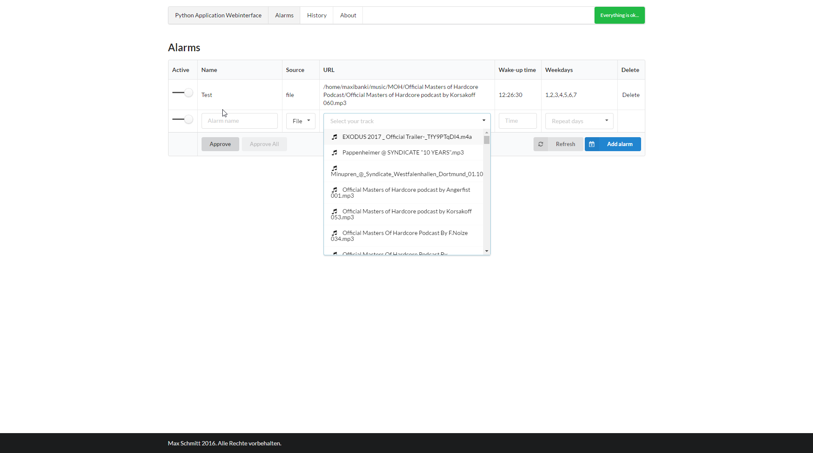
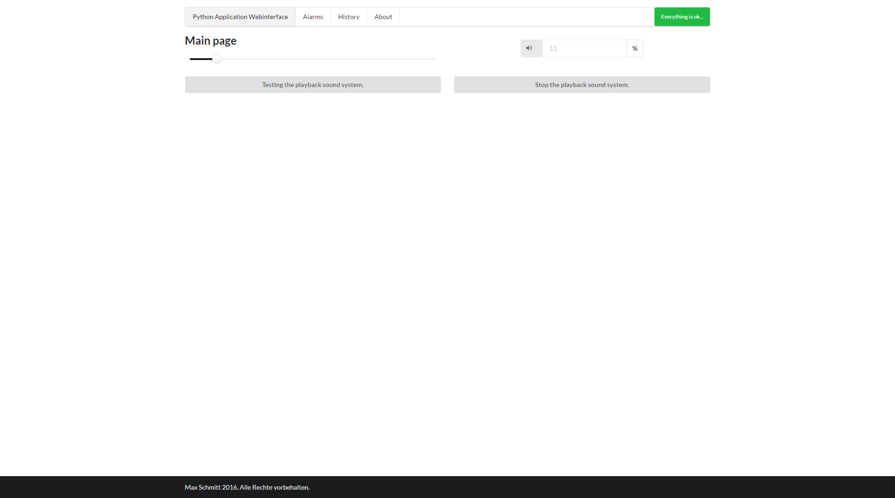
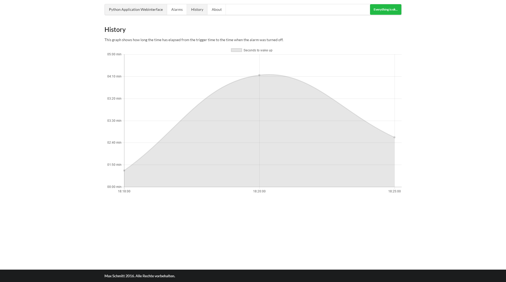

# Raspberry Pi alarm

This repository contains an alarm clock which can be used to wake up by powering an wireless socket and playing music via the aux jack. Optional an USB audio card can be be used of course.

#### Technicial details:

- Frontend based on [Vue.js](https://github.com/vuejs/vue)
- Backend based on Python3.6
- Stylesheets using [Semantic UI](https://github.com/Semantic-Org/Semantic-UI)
- For the alarms in the past [Chart.js](https://github.com/chartjs/Chart.js) is used to visualize them

### How to install?

1. Install [rcswitch-pi](https://github.com/r10r/rcswitch-pi) by following [this](https://github.com/mc-b/microHOME/wiki/Raspberrypi-433) tutorial. Just follow the installation instructions
2. Install the requirements by using the requirements.txt `pip3 install -r requirements.txt`
3. Set the wireless socket code and the Id into the [config.ini](config.ini)
4. Start the python script by `python3 main.py`
5. Access the webinterface by using the port from the config.ini and your ip of your Pi
6. Have a great wake-up :innocent:

### Images

